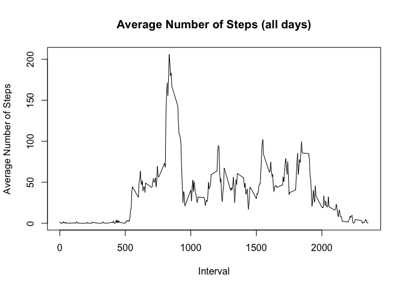

This analysis makes use of data from a personal activity monitoring device. This device collects data at 5 minute intervals through out the day. The data consists of two months of data from an anonymous individual collected during the months of October and November, 2012 and include the number of steps taken in 5 minute intervals each day.

The data to be analyzed resides in a file named *activity.zip* that should be contained in the same working directory as the r script or markdown file.

## Load all needed packages

```r
library(ggplot2)
```


## Load and Preprocess the Data

```r
# Unzip the file to a file named 'activity.csv' in the same directory
unzip(zipfile = "activity.zip")

# Load the data into a data frame
activity <- read.csv(file = "activity.csv")

# Remove all rows having an NA for the steps
completeActivity <- activity[!(is.na(activity$steps)),]
```

## What is the mean total number of steps taken per day?
Create a grouping of steps by date (total steps by date):

```r
stepsByDate <- aggregate(steps ~ date, completeActivity, FUN = sum)
```

The first 6 rows of data looks as follows:

```r
head(stepsByDate)
```

```
##         date steps
## 1 2012-10-02   126
## 2 2012-10-03 11352
## 3 2012-10-04 12116
## 4 2012-10-05 13294
## 5 2012-10-06 15420
## 6 2012-10-07 11015
```

Generate a histogram of Steps per Day:

```r
hist(stepsByDate$steps, main="Steps per Day", xlab="Total number of steps in a day")
```

<!-- -->

The following is the summary of Steps per Day.  Note the **Median** of **10,765** steps and the **Mean** of **10,766** steps.

```r
summary(stepsByDate)
```

```
##      date               steps      
##  Length:53          Min.   :   41  
##  Class :character   1st Qu.: 8841  
##  Mode  :character   Median :10765  
##                     Mean   :10766  
##                     3rd Qu.:13294  
##                     Max.   :21194
```

## What is the average daily activity pattern?
For each 5 minute interval measured, compute the average number of steps taken across all days.

```r
stepsByInterval <- aggregate(steps ~ interval, completeActivity, mean)

head(stepsByInterval)
```

```
##   interval     steps
## 1        0 1.7169811
## 2        5 0.3396226
## 3       10 0.1320755
## 4       15 0.1509434
## 5       20 0.0754717
## 6       25 2.0943396
```

A time series plot showing the average daily pattern:

```r
plot(x = stepsByInterval$interval, y = stepsByInterval$steps, type='l', 
     main="Average Number of Steps (all days)", xlab="Interval", 
     ylab="Average Number of Steps")
```

<!-- -->


```r
# Find row with maximum number of average steps
rowWithMaxSteps <- which.max(stepsByInterval$steps)
# Find the interval for that row
stepsByInterval[rowWithMaxSteps,]
```

```
##     interval    steps
## 104      835 206.1698
```

*The maximum number of average steps (across all days) occurs at interval 835 (206.1698 steps).*


## Imputing missing values

```r
    sum(is.na(activity))
```

```
## [1] 2304
```
*There are 2,304 rows with NA's.*

We will fill in each missing steps value (an NA) with the mean of steps for that same interval accross all all days.

```r
filledActivity <- activity
for (i in 1:nrow(filledActivity))
{
    if (is.na(filledActivity$steps[i]))
    {
        # Get the mean value of steps for the specified interval (all non-NA rows)
        stepsMean <- stepsByInterval[stepsByInterval$interval == filledActivity$interval[i],]
        
        # Update the current (currently NA) to the mean value
        filledActivity$steps[i] <- stepsMean$steps
    }
}
```


```r
    sum(is.na(filledActivity))
```

```
## [1] 0
```

*Now there are 0 rows with missing values*

Compute the total number of steps by day.

```r
filledActivityTotalStepsByDate <- aggregate(steps ~ date, filledActivity, sum)

head(filledActivityTotalStepsByDate)
```

```
##         date    steps
## 1 2012-10-01 10766.19
## 2 2012-10-02   126.00
## 3 2012-10-03 11352.00
## 4 2012-10-04 12116.00
## 5 2012-10-05 13294.00
## 6 2012-10-06 15420.00
```


```r
hist(filledActivityTotalStepsByDate$steps, main="Total Steps per Day", xlab="Total Steps in a Day")
```

<!-- -->


The following is the summary of Steps per Day after filling in missing values.  Note the **Median** of **10,766** steps and the **Mean** of **10,766** steps.


```r
summary(filledActivityTotalStepsByDate)
```

```
##      date               steps      
##  Length:61          Min.   :   41  
##  Class :character   1st Qu.: 9819  
##  Mode  :character   Median :10766  
##                     Mean   :10766  
##                     3rd Qu.:12811  
##                     Max.   :21194
```
As a reminder, the **Median** is **10,765** and the **Mean** is **10,766** steps excluding misssing values.

```r
summary(stepsByDate)
```

```
##      date               steps      
##  Length:53          Min.   :   41  
##  Class :character   1st Qu.: 8841  
##  Mode  :character   Median :10765  
##                     Mean   :10766  
##                     3rd Qu.:13294  
##                     Max.   :21194
```

So, filling values did not impact the mean but slightly changed the median which seems reasonable since missing values were filled in with the mean.


## Are there differences in activity patterns between weekdays and weekends?

First, add a new attribute 'typeOfDay' indicating weekday or weekend

```r
filledActivity['typeOfDay'] <- weekdays(as.Date(filledActivity$date))
filledActivity$typeOfDay[filledActivity$typeOfDay  %in% c('Saturday','Sunday') ] <- "weekend"
filledActivity$typeOfDay[filledActivity$typeOfDay != "weekend"] <- "weekday"
```


```r
head(filledActivity)
```

```
##       steps       date interval typeOfDay
## 1 1.7169811 2012-10-01        0   weekday
## 2 0.3396226 2012-10-01        5   weekday
## 3 0.1320755 2012-10-01       10   weekday
## 4 0.1509434 2012-10-01       15   weekday
## 5 0.0754717 2012-10-01       20   weekday
## 6 2.0943396 2012-10-01       25   weekday
```

Convert typeOfDay  from character to factor

```r
filledActivity$typeOfDay <- as.factor(filledActivity$typeOfDay)
```

Calculate average steps by interval and type of day (weekday vs weekend)

```r
filledActivityStepsByIntervall <- aggregate(steps ~ interval + typeOfDay, filledActivity, mean)

head(filledActivityStepsByIntervall, 12)
```

```
##    interval typeOfDay      steps
## 1         0   weekday 2.25115304
## 2         5   weekday 0.44528302
## 3        10   weekday 0.17316562
## 4        15   weekday 0.19790356
## 5        20   weekday 0.09895178
## 6        25   weekday 1.59035639
## 7        30   weekday 0.69266247
## 8        35   weekday 1.13794549
## 9        40   weekday 0.00000000
## 10       45   weekday 1.79622642
## 11       50   weekday 0.39580713
## 12       55   weekday 0.01761006
```

Plot as a time series to show the differences betweeen weekend and weekday for each interval.

```r
qplot(interval, 
      steps, 
      data = filledActivityStepsByIntervall, 
      geom=c("line"),
      xlab = "Interval", 
      ylab = "Number of steps", 
      main = "") +
  facet_wrap(~ typeOfDay, ncol = 1)
```

<!-- -->
